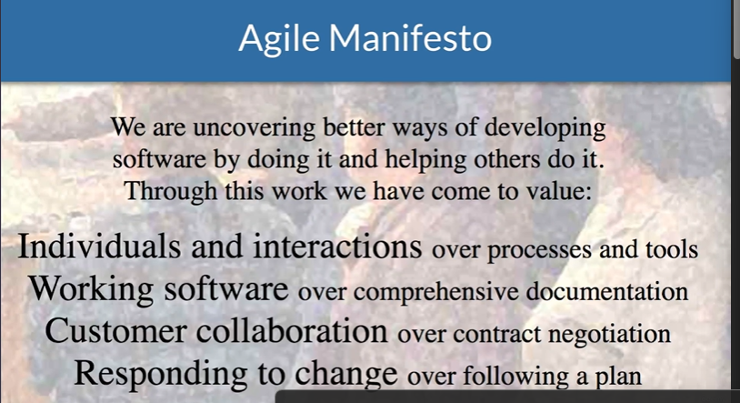
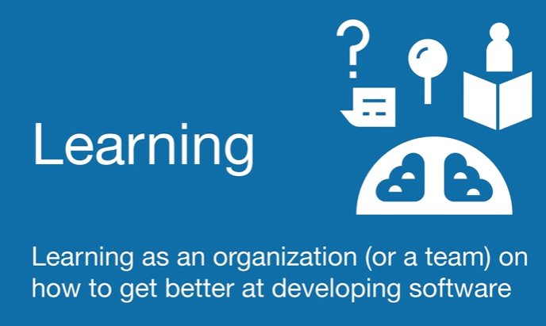
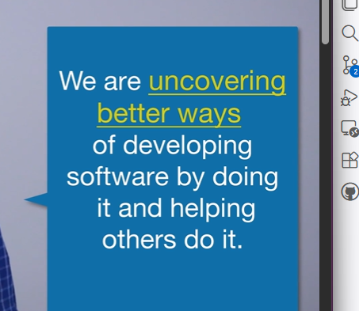
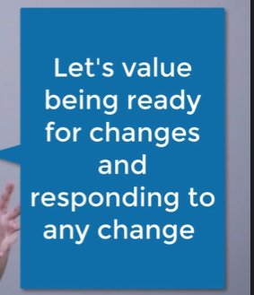

# Introduction to Agile

> Agile personally to me is a philosophy and a way of thinking that's guided by 4 values and 12 priciples
> That being said I want you think about Agile as a mindset over a framework, process or methodology.

Navigate to agilemanifesto.org

> Agile is more of a mindset and a belief system.

```txt
So let's assimilate a very simple example.

You have X amount of dollars and you want to build an app.
Let's say this is a game that you're trying to build,
and you have certain amount of money and you hire Vivek
and the team from The Agile Coach
to build this game for you.
How would you want to get your product delivered to you?
In what fashion?

Would you want value in a weekly basis,
or would you want us to give you a lot of documents
and wireframes and different ways of doing it,
except the working software?

Obviously the working software.

How would you want us to work with you,
since you are the customer?

Would you want us to collaborate with you
and come up with on how you should build this game?
Or would you want us to lock into a contract
where we only deliver
to you what you gave us initially when you had only so
much idea about your game?

Another example.

This game that you had thought of,
you had a specific plan for this.
But a month into it,
let's say there's another competition that has already
developed a really good game that has all these features.

However, you get a pretty good advice
from an investor who wants you to tweak a few things
and that makes your game still viable in the market.
Would you want your software development team
at theagilecoach.com to be able to respond
to your needs and the change in requirements?
Or would you want us to give you a hard time about,

"Hey, you gave us this roadmap, this plan,
and we're gonna stick to it?"
Obviously, you want us to be flexible.
So that is what it means to Agile
from a manifesto perspective, and we're gonna go
into deep and explore what the principles actually mean.
```

## Agile Manifesto

We are **uncovering better ways**
of developing software by doing it and helping others do it.




* Uncovering better ways? - what does it mean to you?



## 1. **Individuals and Interactions** Over Processes and Tools

* **Individuals and Interactions** Over Processes and Tools
  * > People Interacting with each other and business folks
  * > It's not that we don't value processes and tools. Yes, they are important but given a situation if we say we want to be agile we are going to value the people and the interaction more. So to me this statement means we value more face to face communication or communication over a quick phone call, emails or creating a ticket. That takes a lot of time and creates a lot of confusion
  * > In Estimation work ; we will value interaction & conversations more that the actual result of what the estimate is
  * > > Sometimes team members get hung up on how big this item is. And when we come to that situation we are going to value the interaction among the team members and talking through what are the complexities of this work and why do we think this is so complicated.
  * So we will value that interaction more than the actual story point or how big the story is


## 2. **Working Software** Over Comprehensive Documentation

* **Working Software** Over Comprehensive Documentation

The second value of the Agile Manifesto is **working software over comprehensive documentation**. It doesn't mean that we don't need documentation. In fact, it can be extremely frustrating when there is no documentation, and it can be really difficult for developers or customers to navigate the software.

However, a key thing to pay attention to in this value is the word **“comprehensive.”** Let's not spend a lot of time just writing documents, because the main deliverable is the software.

Even when you're thinking from a business requirements perspective, one of the main things that comes out of gathering requirements is **shared understanding**. What this principle says is that you can create shared understanding through more conversations among team members, stakeholders, and potentially even customers.

One way you can accomplish this shared understanding of the software is by creating small increments of the software and putting them in the hands of internal stakeholders or customers. This allows you to gain feedback from them and understand what they actually want from the software.

Again, if you go back to the first line of the Agile Manifesto, it is about **uncovering better ways**, which means learning better ways. So, the emphasis here is for teams to learn.

One of the ways that you can learn is by **failing faster**. When you create small increments of software and put them in the hands of customers without focusing too much on creating a huge amount of documentation, this allows teams to create something quickly and learn quickly.

So, in conclusion, you want to create more working software, learn faster, and create shared understanding. And yes, documentation is important, but let's just not go all crazy with documents.

## 3. **Customer Collaboration** Over Contract Negotiation

* **Customer Collaboration** Over Contract Negotiation

The third value of the Agile Manifesto is **customer collaboration over contract negotiation**.

The key thing that you want to keep in mind in this value is **customer collaboration**. We want to collaborate with our customers because we want to delight them, build a strong relationship, and have them come back to us and rely on our expertise to develop their software.

However, we also want to change the way we write our contracts or agreements. In the past, most contracts were written based on business requirements or functional requirement documents. Throughout the course of a project, however, it is very difficult to predict everything accurately, and requirements usually change.

And there goes the contract. Now, as a development team, we have to work based on the contract, and the client expects us to execute exactly what was agreed upon. This can create a lose-lose situation for both sides.

What we are suggesting instead is to structure contracts and agreements in a way that keeps **customer success** in mind. Rather than focusing solely on delivering exactly what was defined at the beginning of the project, we should collaborate with the customer throughout the development process, adapt to changing needs, and work together toward achieving the best possible outcome.


It's actually not fair for development teams
to ask for all the requirements
from the customer or the client in day one.
They're coming to you in the first place for help
because they want this piece of software to be built by you.
So rather than putting them into a strong contract,
we want to collaborate with them
and help them understand what they need in the software
so that they can really delight their customer.
So this principle is saying that
instead of having a strict contract up front,
collaboration is the key,
work with the customer or the client throughout the project
and you want to create a win-win situation
where if your customer or your client wins, then you win.

## 4. **Responding to Change** Over Following a Plan


* **Responding to Change** Over Following a Plan





```txt
The last value of the Manifesto is
responding to change over following a plan.
This value just means that having a plan is very important.
It's almost silly not to have a plan.
In software development,
we have all kind of plannings,
however less value on being ready
and being able to respond with the changes
if they actually happen.
Traditionally, when we are planning for projects,
what we are seeing is if the conditions of the universe
didn't change between now and the moment,
what kind of things would we do
in order to accomplish this project?
And we write those things down and we talk about it,
and we document it,
and we can actually throw that piece of plan away
because most likely
if we are developing a complex piece of software,
something will change and then the plan will not be useful.
So planning is very important.
We need some kind of plan,
but we need to be able to respond to change
as they happen in a accomplished environment.
So think about any kind of hurricane
that actually happens around the world.
There was one that happened here in the United States
was called Maria,
and the mayor came to the TV and said,
We're gonna do this, this, this, and this.
And this is our plan.
This is how we are getting ready.
However, he said that all this is is important.
However, when the hurricane actually comes,
we wanna be able to respond to the hurricane
versus just following a plan that we had.
And he said another quote by Mike Tyson,
"Everybody has a plan until they get punched on their face."
So we can have all kind of nice plans set up
but it's important to respond to the change
or just follow and stick to the plan
if something has actually changed.
```


So these are the four values of Agile for you.
You wanna really think about how can you apply these values
and be agile in your team or an organization
because it's again, it's a mindset,
it's about an agreement
that you can form within the company,
and people can really think about
these values when they are making decisions
in their day to day lives
in software development environments.

# 12 Agile Priciples

## Agile Principle #1:

Our highest priority is to satisfy the customer through **early** and
**continuous** delivery of valuable software

```txt
There are two things that stand out to me.
First thing is faster or early on
and the second thing is continuously.
So in contrast to traditional Waterfall development instead of doing regular design and then development and then testing and then implementation
where the value is realized at the end of the project Agile says try to deliver value faster, almost every week or every other week, where you can give some kind of valuable software to customer, a feature to the customer and they can give you feedback.
```

## Agile Principle #2

Welcome changing requirements, even late in development. Agile processes harness change for the customer's competitive
advantage.


```txt
Responding to change in 21st century is crucial for any business, even a small business
you need to be able to respond to change.
So what this principle is saying is
if somebody is part of an Agile team
and if they're delivering something to their customer
think about being able to create something for the customer
in case something changes on their business end.
-: Sure.

And it's also about delighting customers as well
and really responding to their needs.
Because if you think about
in the traditional Waterfall development
where a customer comes with the initial set
of requirements and there's a signup process
and once you do that, you cannot really change anything.
So in the Agile processes where you can actually
change and you are open to change.
```


```txt
And it really comes back to the main quote
that I've heard all the time,
that the only constant in business is change.
Business is always evolving, businesses are always changing.
Of course that project's going to evolve and change.
```

## Agile Principle #3:

Deliver **working software** ***frequently***, from a couple of weeks to a
couple of months, with a preference to the shorter timescale.

```txt
So two things in this, this principle
working software and then frequently.
So in this principle what we are saying is focus
on the working software.
And when we say working software, it is not a requirement
it is not a mock-up, it is not a wireframe,
it is working software, something that actually works
a part of the feature that you can give it to the customer
receive feedback and see how they use it.
And then the second thing is the time scale.

-: Sure.

You are trying to shoot
for the shorter time scale, a few weeks
and every few weeks you're trying to have some sort
of working software
and you're trying to give that to your customer.

-: Absolutely.

So the working software is so you can give it
to 'em so they can get their hands on it.
Because most change and most ideas will come
out when they actually start working with it
and they can see themselves trying to meet
that business need.
So that's absolutely crucial
and I think that's a huge, huge proponent of Agile.
```

## Agile Principle #4:

Business people and developers must work together daily throughout the project.

```txt
So think about you and I were both business analyst
at some point, right?
So remember how we were the liaison
between the development team
and the stakeholders or business folks.
So here what Agile is saying is there's no need
for a creation of this layer.
Developers, the team and the stakeholders
or the customers can actually talk.
And in fact it's encouraged.
They're talking on almost on a daily basis.
And the other thing to remember is we're not talking about business people asking developer
when is this going to be done?
When is this going to be done?

-: Sure.

We're talking about collaboration.
What are we building?
Has anything changed?
So that kind of communication is happening throughout.
Yeah, I think sometimes the business analyst
becomes a bottleneck, you know,
in a traditional Waterfall methodology.
And with Agile it removes the blinders
from the developer and allows them to get their questions
answered directly from the source rather than going
through a layer which doesn't really add much value.

-: Yep.

It just helps everybody to get
on the same page on what they're building.
```

## Agile Principle #5:

Build projects around motivated individuals.
Give them the environment and support they need, and trust them to get the job done.

```txt
So Vivek, what does that mean to you?

-: Yeah, Jeremy, the key concept here is

there's no project manager trying to ask you, you know,
what did you do yesterday?
Or like, how much have you done?
Like no status reports.

The idea here is, hire a really good
motivated group of individuals, part of the team
who are cross-functional and actually give them space to
actually do amazing work.
And when we say work, not just develop software
but also to solve problems for the company or the client.

-: Yeah, it's always about creating value, right?

Yeah, and so I think the big thing to keep in mind here
if you're going to work in an Agile team,
is regardless of your title,
these teams are cross-functional.
That means they cross over roles.
Your duties and responsibilities are going to evolve
and change.
And that is because everybody's collaborating together to
try to realize that end value.
```

## Agile Principle #6 :

The most efficient and effective method of conveying information to and within a development team is face-to-face conversation.

```txt
The most efficient and effective method
of conveying information to and
within a development team is face-to-face conversation.
Well, summarizing principle number six is pretty easy.
Face-to-face communication.

Vivek, what does that mean to you?

Yeah, what this means is instead of writing a big piece
of requirement document and giving to a developer
we are encouraging more face-to-face communication.

Or even worse, creating a ticket
or messaging them and bothering them all the time.
Just having meetings face
to face where you are able to communicate what you need.
Having a conversation, what a novel idea.
Yep. And also if you look at all the Agile meetings
it actually encourages face-to-face communication as well.
```

## Agile Principle #7:

Working Software is the primary measure of progress

```txt
Working software is the primary measure of progress.
To summarize working software is key, Vivek.

This principle is just saying that whenever we're thinking
about progress, let's measure that in terms
of our working software, what have we built?
Not how much analysis we've done or how many pages
of documentation we have created
or how many mock-up pages we've created.
This is purely working software.

-: And that makes sense.

And while we may be creating models in part
of that and have 'em attached to our various items.
The working software is really what we're driving towards
and what will create the most value.
```

## Agile Principle #8:

Agile processes promote sustainable development.  
The sponsors, developers, and users should be able to maintain a constant pace indefinitely.

```txt
Principle number eight's all about sustainable development.

Vivek, what do you think?

-: So Jeremy, remember those traditional days where
business analysts is doing all kind of analysis
they're stressed and they hit their deadline, they finish
they give it to a developer.
Now development team is stressed out
and they're trying to make the ends meet, hit the deadline
and then finally they're done.
Then it goes to tester, it's tester's
time to be stressful now.
They're testing everything
and then implementation time comes
and everybody is stressed.

-: Yep.

So in Agile what we're trying to do is instead
of this big bang thing
where in everybody's working in phases,
we're talking about okay, what are key features?
What we need to do?
What is team's capacity?
And think about a sustainable pace
that the team can developed in.

-: Yeah, and I think that's really important
because in Agile the whole team is getting together
so it makes it more sustainable cuz people,
it's a cross-functional team.
So everybody's able to help move
that particular project forward to meet the value.
```

## Agile Principle #9:

Continuous attention to technical excellence and good design enhances agility.

```txt
-: I wanna talk a little bit about quality in this principle.
So if you build something
and if there is no quality in place,
you cannot build anything on top of it.
So it's gonna be harder for you to be Agile in the future.
So Agile says, think about quality,
think about technical excellence
as you're building certain product.

-: Absolutely, yeah.

You evolve those features
and functionality you've built, right?
You're making slight changes to them
and a additions to them to help drive value later on.
If you've got problems early on
in that design or in that initial quality
you're gonna have problems for a long time.

```

## Agile Principle #10:

Simplicity-the art of maximizing the amount of work not done-is essential.

```txt
Simplicity, the art of maximizing the amount
of work not done is essential.
Summarizing number ten is really easy.
Simplicity, Vivek, What do you think?

-: When I think about this principle, Jeremy
I think about Google's landing page.
So when you go to Google's landing page
it is just one source button and it's a white screen
and it is beautiful on the way that it works.
Just because you have more and more features
it doesn't make a software pleasant to use.
So the idea here is
in Agile you're also thinking about the outcome.
Like what kind of outcome are you looking?
And you can do that
by building less and less and delivering more.

-: Got it.

So making sure that you are delivering value
on everything that you're building, not just
building something or creating something to create it.
```

## Agile Principle #11:

The best architectures, requirements, and designs emerge from self-organizing teams.

```txt
-: Yeah, so in teams where the teams are self organizing and cross-functional, meaning depending
on what kind of projects you're working on
you are gonna have people with the right skill sets.
And that's what a team is formed of
is everybody in the team has unique skill sets and they have what it takes to make this project successful.
So when they need something
a question about an architecture, they already have somebody
in that team so they can actually talk
to somebody versus borrowing somebody from somebody else.

-: Yeah, I know in Waterfall or in other methodologies
a lot of times you need to go ask a manager,
Hey can I have somebody from your team
from your testing team to help out with this?
And usually takes a long time.

Where an Agile
with the being self organizing
if you need somebody you can go tap them on the shoulder
and see if they have availability to come help your team
or to join the team potentially.
```

## Agile Principle #12:

At regular intervals, the team reflects on how to become more effective, then tunes and adjusts its behavior accordingly.

```txt
-: This is actually one of the key principles
of Agile that's one of my favorite principle
of Agile as well.
So as you're working in a product, as a team
you're gonna learn different things
about each other ways of working.
So at each interval, like every two, three weeks
you're getting back and you're looking at what went well
what didn't go well, and how can we improve?
And this is a key principle of Agile.

-: Yeah. And I think in Waterfall

reflect and adjust is there as well.
Like Waterfall or any other methodologies,
they want to reflect and get better and change and adapt.
But the challenge is in a Waterfall project

you have that at the end of the project.
That could be three months, six months, twelve months from the time you start a project and it's just too long.
You don't get enough time to reflect and adjust.

We're Agile with it being more iterative.
Every few weeks you're actually able to look in see how it's going, and make adjustments as necessary to make the team even more successful.
```