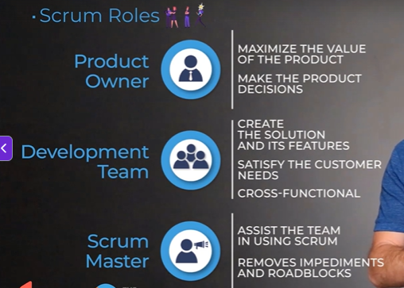

## Scrum Overview

```txt
Scrum is a framework
for delivering, developing, and sustaining complex products.
It's built on the foundations of agile,
of iterating and adapting to change,
as well it follows the philosophy of empiricism,
which is learning through experimentation
and making decisions based on what is known.

Scrum provides a blueprint or a pattern that can be followed
to deliver solutions that satisfy the customer needs.
It does this by dictating roles, events, and artifacts
as well as rules and best practices
to help tie everything together.

We're gonna get into more specifics in later lectures,
but first, we need to understand
the three pillars of Scrum:
```

## Scrum 3 Pillars

1. **Transparency**

* The process
must be visible
* The language used
must be common
and understandable
* Have a shared understanding
* Information is shared
openly and freely

2. **Inspection**

* Measure advancement towards the goal
* Identify non-desirable issues that would inhibit reaching the goal


3. **Adaption**

* Adjust processes, solutions, and decisions
* Avoid or correct issues identified during the inspection


## Scrum Values

```txt
These values are very powerful and effective
because Scrum is leveraged by a team
and these values really support team members
when they are working to solve complex problems.
```


1. **Openness**


```txt
Openness just means that team members are open to living the Scrum values over just doing Scrum.
Team members are open to uncover and find effective ways of solving problems.
Whenever team members are solving on our tough problems.
Openness can mean that they are open
to inspecting and adapting
and figuring out better ways
to solve that problem as a team.
So being open to other people's ideas
and being open to change in general.
```


2. **Commitment**

* General understanding of Commitment in this context is to commitment
to the sprint goal. However, it's more than that !  

* Team commits to working as a team and doing their best to bring value
to the customer  

* Team commits to give their best
action & effort Versus to the
results at the end of the Sprint.

```txt
Whenever people are looking at this value
people immediately think about commitment
to doing the work
or executing on the sprint goal
or the work that team has committed to.
But it's actually more than that.
This means that team members are committed
to each other in terms of doing their best
and coming up with solutions collaboratively.
This actually also means commitment
to not only just delivering software
but delivering software to solve end users
or customers problems.
Commitment also means that team members
are going to give their best action
and effort to solve a problem
versus just focusing on a sprint goal.
```

3. **Focus**

* Focus on the sprint's worth of work

* Focus on removing solving problems
and removing impediments

* Focus on the bringing
value to customers

```txt
If you are trying to solve any kind of problem, human beings needs to be able to focus.
Scrum recommends that team members plan
on a certain amount of work
and they focus on that for a certain period of time.
And the whole goal of the team is to get this work
that they picked to done.
Focus can also mean that team members are focused
on solving a problem that they have decided as a team to do
versus thinking about every shiny thing that's out there
and trying to build everything.
Focus can also mean that team members
are focused on customer happiness
and delivering value to the stakeholders.
```


4. **Courage**

Mark Twain said - 
"Courage is not the absence of fear,
it is acting in spite of it."

* Team members show up with courage when working in tough problems

* Team members show up with courage while dealing with constant change
and adapting.


```txt
Courage in this context means that team members show up
with courage when they're working on tough problems
and they're not afraid to try
and come up with their bold ideas.
Change is usually hard and we are not perfect.
However, this Scrum value encourages team members
to do their best despite of not being perfect
and despite of change being hard.
```

5. **Respect**

* Respect each other in the team and be professional
* Respect and embrace the differences (different opinions, ways of working,
solving problems culture and background)

```txt
Whenever we are working on difficult problems
and we are working as a team
and we share our success and failures together,
we will be professional
and we'll respect the team members culture,
their background, their ways of working
and we will also respect their opinion.
Those are the five strong values
and if team members focus on embracing these strong values
on a day-to-day basis,
it is much effective for teams to acquire the agile mindset.
```

## Scrum Roles

1. Scrum Roles
2. Scrum Events
3. Scrum Artifacts

### . Scrum Roles



* Product Owner
* Development Team
* Scrum Master

```txt
And last but not least, the Scrum Master.
The master of Scrum.
Because they're the Scrum expert,
they understand the theory, the practices,
rules, and values of the Scrum framework,
and it's the Scrum Master's responsibility
to ensure the product owner
and the development team do as well.
The Scrum Master is often referred to as the servant leader
because they're enabling the development team
to create maximum value by removing their impediments
or the roadblocks to their progress.
Maybe the team is unable to identify
someone to answer a specific question.
So they're unable to move forward on a feature.
Instead of the development team spending time
on trying to find that person, the Scrum Master could do it.
This allows the team then to continue to create
other functionality in the meantime,
maximizing the value, the development team
and the Scrum team as a whole, is able to create.
```

## 19. Role of a Scrum Master - A conversation

```txt
My recent experience was, you know
working as a scrum master
I just love the idea of being a team facilitator
and making sure I get to coach the team a little bit
on scrum values and scrum methodology
and I get to remove impediments.
So, you know, my day started out by, you know, being
in the daily standup and that's a 15 minutes meeting again
like we talked in the lecture, you know
I go around and I say, "Okay, let's just go around
and answer the three question, What did you do yesterday?
What are you gonna focus on today?
And do you have impediments?"
And we go around and I'm actually focused
on hearing however we is doing, and
if there's an impediment, I'm actually making a list
of impediments so that I can make it visible
or I can work with a team member to go out there
and resolve their impediment.
I've also been in an environment where people
didn't want to answer those three questions.
So one of the things that I did is I did something
called appreciative inquiry.
So the question, instead of asking
"What did you do yesterday?"
What we said is, "What are you gonna focus on today?
Are we in track to meet our sprint goal?
And do you have any impediments?"
So that's a little bit more indirect
and people felt and resonated with this question.
So you can run your daily standard that way too.
So that was really well.
And then after that, you know, I go about
and I work with the developer to remove those impediments.
Let's say they don't have some kind
of data for testing or
if they need some servers or if they need to talk
to another team member for certain
I would facilitate those meetings
and whatever the team needed, I would facilitate
the sprint planning where team plans
for the iteration or the sprint and you know
these are the things that we want to get it done
and this is our sprint goal.
I facilitated that.
So I would invite all the necessary people into the room.
I would even go and ask the stakeholder
to come in the planning
or if you need any kind of clarification.
And I would make sure that we had talked
about the sprint goal at the end of the sprint planning.
```

```txt
-: Excellent.
Again, I think that's one really cool thing when
I was working in some Agile projects that when
the scrum master hears
that roadblock or that impediment.
As you're in there and people are kind of talking
about it like, you don't usually, like, it doesn't come out.
It's not like, "Oh, I have this problem
I can't move forward."
It's, "Oh, I'm running into a challenge with this."
Right?
And then that scrum master I've had in the meeting say
"Actually, hey, let me talk to you after this real quick.
I know somebody that you can talk to that might be able to
give you some assistance."
Right?
And they're just removing that
and just helping that team continue to drive forward.
And not be stopped by
-: Yeah, I like that.
You know, this is why there's a need for a scrum master.
So, because again,
we have a two weeks iteration or three weeks, right?
Team is so focused on getting those stories done done
that sometimes the impediments might, you know
that's task switching.
So it's good to have somebody who can kind of facilitate
and resolve those impediments
and he's thinking in a way where, you know
what are some of the challenges that team is having?
What are some of the ongoing impediments?
Somebody's really has the connection and, and is thinking
in a very resourceful way for team to get going.
And team is focused on developing
and producing end to end working software.
```

```txt
-: Yeah, and you talked a little bit
about how the scrum master
is facilitating both the daily stand-ups as well
as the the sprint planning meeting.
What about like sprint review
and retrospective and stuff like that?
Are they doing the same thing there?
-: Yeah, let's go to sprint review.
So sprint review is a meeting where you review your sprint.
What did we do in this sprint?
Again, this is not perfect product.
You know, sometime you have a plan and you might
there might be a few stories that are not done.
It's totally okay in the sprint planning.
-: Well, it's not always okay, you know? (laughs)
-: Yeah, in the sprint review it's-
-: It's okay there. (laughs)
-: Yeah, well the team is learning, right?
Initially they estimate too many things
and scrum masters-
-: We always overcommit, right?
-: I know that the team is not going to finish this
but I'm not saying anything, I want them to learn.
Right?
So it's okay.
So I facilitate the sprint review and I even invite some
of the stakeholders or external customers there.
If we need some feedback
of we need to do an informal here, here's what we have.
Right?
In that meeting we're kind of reviewing
the progress compared to our product backlog
and what do we need to change
in the product backlog based on what we have completed.
And maybe we're doing reestimating
of some of these stories and
moving some of these stories to next sprint.
So we're doing those things in this virtual review.
```

```txt
And then the retrospective is one
of my favorite meeting to facilitate
in the retrospective as a scrum master
I'm sending out camera invites for everybody
in the team making sure everybody can attend that meeting.
Having a space, and having an open space
where a team can actually-
not a loud space, but a quiet space
a nice meeting room where people can actually talk
about what happened in this sprint.
And really facilitate in a way where, you know
some of the team members are not talkative
and others are really talkative and optimistic
and usually sometimes they actually take
over the conversation and they blast the others
with ideas and it's almost overwhelming sometime, right?
So what I do is when whenever we are
in that retrospective room, I am actually, you know
going around and I'm facilitating, "Okay
we're gonna actually start and here's sticky notes.
Why don't you just write down things in those three columns?
What went well, what didn't go well
and what do we wanna improve?"
And I'll give them five minutes to think about it, right?
So that they have time to actually think
about what those items.
And then I'll collect those things
and I'll actually post it on the wall and I'll say, "Okay
well this is the overall team sentiment, you know
this is how we did in this situation."
Like fine, you know, some
of the things that might have gone wrong.
So I addressed the elephant
in the room and make it less awkward.
I go around and say, "Okay, well Tim, you said this
like why don't you tell us more?
Like what are you actually feeling?
And when Max, what about you?
You know, what were your challenges?
Why did you think this was something
that we want to improve on?
What's the actual pain point?"
So facilitating those conversations, it's really fun for me.
```

## 20. Role of the Product Owner - A Conversation

```txt
Vivek: So Jeremy, you've been a product owner
for a team, so what was your experience like?
-: It was different, that's for sure.
So as a product owner, I mean
obviously you're meeting with the business
and then helping to translate that into work units,
user stories for the team to work on right?
-: Yeah.
-: I mean that's ultimately what the product owner's doing.
So at the beginning it was fairly similar
to what a business analyst does, right?
Gathering the requirements, listening to those requirements
and then putting 'em into work items.
-: Yeah.
-: I think the really challenging part of it
was just the fact that there's a lot of business people
and being like that one person that everybody's coming to
with any changes or problems.
And then also you have the team on the other side.
-: Yeah. -: You are constantly balancing
on that line, towing that line as to,
okay, I can't always make the business happy
because I understand where the project team's coming from
but I also have to not just concede to what we can get done.
-: Yeah. -: Cause I need to
meet the needs of the business.
-: Yeah. -: And so it's that,
balancing act, so there's a lot of managerial type of stuff
that really help out as a product owner.
-: Yeah.
-: So that's some of the challenges.
Some of the nice things about being a product owner
when you're going into those meetings,
helping to prioritize,
keeping people on, kind of, the right tasks, right?
Not worrying about how they're accomplishing it,
explaining the, 'what' this is what we need to have done.
This is the type of functionality that's needed,
use the need.
And then it's kind of, it was always interesting to see
how the team designed that solution
and then brought that solution forward.
-: Yeah. -: So that was always
a nice thing, and then being able to take that,
go back to the business and get their feedback on it.
-: Yeah. -: Or have them come in
for a demo or depending on the type of change that was made.
```

```txt
-: Yeah. So, my experience of being a product owner,
product manager was, you know, startup company.
And you know, I remember sitting down with the CEO
of a company who had co-founded this startup,
and he needed a product manager and product owner.
And I remember having a conversation with him and he said,
Vivek, so your role is to actually work with me
in terms of getting me organized on what I think
the product should look like.
But then also validating that by running experiments
with the customers, where customers are also on board.
Where I'm not just kind of thinking about
all these amazing things about my product,
this also resonates with the customer.
So what I did is I actually wrote a lot of user stories.
These small description of requirements
or product features. -: Sure.
-: From a customer's perspective,
capturing who, what and why.
-: Yeah. -: And what I did,
is I actually prioritize those user stories
and I gave it to the developers and I said,
this is the sequences, these are the high priority stories.
And you know, a lot of the times
I actually worked with this CEO.
He got excited about every shiny thing that was out there.
He wanted-
-: Every feature you could build he wanted to build, right?
-: Yeah. He wanted, and then I said, this is a great idea.
However, there are other higher priority items
that we have that's gonna bring more money to your startups.
It's gonna solve customer problems better
if you focus on these features.
So it was a a lot of my role was saying no
to external request or his ideas that, or pet projects,
or pet features. -: Sure.
-: And then also avoid feature loads.
Instead of having this feature really, really
adding all the belts and whistles, you know?
The focus was getting MVP
and getting certain amount of users in the system
and based on studying how they engage in the product
then we can evolve, incrementally,
evolve the product. -: Good.
```

```txt
And and you mentioned MVP. -: Yeah.
-: Which is the, the minimum viable product.
-: Yeah.
-: Ultimately, like what's the lowest thing
that we could deliver that'll actually create some value,
or create enough value for that customer
to at least get 'em started.
-: So let's talk about some of the challenges.
And I've been a scrum master
and I've worked in things where, you know,
I've had a little bit of a challenge with the product owner.
A lot of the product owners are coming
from the waterfall world
and they are maybe not trained enough
on how to play in the team.
So, I've been in a situation where a product owner
was spread out across three teams
and it was extremely difficult for the team members
to actually get the priority and the vision of the product.
And I was in the middle because I was a scrum master,
and I was a new scrum master and it was a tricky position.
You know? Just how do you, so, you know, I said,
that we need you more for availability,
but the way that it was set up
is because he was spread out in in three teams.
So I, one thing that I learned is, you know,
a team should have a dedicated product owner
and somebody who's available for the team
to understand the product vision,
understand the next high priority stories so the team can,
so then it doesn't create any roadblock or confusion
for the team. -: Absolutely.
```

```txt
-: And I think that, you know when I was a product owner
I was the product owner for three products.
Started as one. -: Yeah.
-: Gained two extra products.
And now was the product owner of three products.
Two of 'em were with the same project team.
-: Yeah. -: Which another no-no.
Right? -: Yeah.
-: But cause they're working, have two projects at once.
But, so two of 'em were for that
but one of 'em was completely separate and yeah,
I could, you could feel the pull. Right?
That was my only job there. I was consulting there.
So that was my only job.
I can't even imagine a regular, like a senior manager
or some director that has their normal duties
and then are being asked to be a product owner
and then being maybe a product owner of multiple roles
that gets really difficult.
But, I mean, those companies,
they have to dedicate that time.
If they're not willing to have a dedicated product owner
to the project then maybe Scrum isn't the right fit for them
because that- -: A hundred percent.
-: You need to have that or you're not gonna be successful.
```


```txt
-: Yeah. In today's day and age, right?
Product owners should also have skill sets on how to
actually study the user base and talk to them
and really find out what they actually want.
I think it's very important for product owner
to actually engage the user base
and then just question them a little bit.
Are you sure? Like, you're saying this?
And then also-
-: What do you like about it?
What don't you like about it?
Like make really pulling that out, right?
-: Yeah. And then give them a very simple version
of the product and say, okay, well use this
and see how they use the product.
And based on that, based on their behaviors
make decisions on how they should evolve the product.
And that's how you can learn a lot about what to build
because that's the sole responsibility of the product owner.
Right? They, they should know how they should evolve
the product and they should have a pretty good vision
on how they want to expand the product line.
-: Absolutely. Yeah.
Their number one goal is to make the business happy
and to solve that business problem.
-: Yep.
-: They have to be able to do that
in order to make that happen. -: Great.
```

## 21. Role of the Developers - A Conversation

```txt
Right Speaker: Let's talk about the dev team.
So, you know, a developer, a QA, a BA, architect,
UI developer, UI guy.
Left Speaker: Basically everybody,
other than the product owner and the scrum master, right?
Everybody else is bulked into there.
Right Speaker: Let's talk about what
the developers are doing.
So I've been in, been a SQL developer for a little bit
and you know, being part of the Agile team.
So when you are a developer, part of the Agile team,
you are not seeing that, I can only do this.
Even though I was working in the SQL part,
I was still learning on other components
of what the team was developing.
And I was empowered to learn other things.
-: You're helping with it all.
-: Yeah. So, you know, in the Agile team,
no matter what your title is, you are just part of the team
and you wanna, you are a self organizing team
but you also wanna help each other out.
```

```txt
What was your experience?
Left Speaker: Yeah. And that was very similar.
So working as a business analyst
and quality assurance analyst,
doing testing within a team, it was very similar.
So, it was very interesting,
coming from Waterfall and going into that.
The business analyst traditionally has, you know,
there's certain roles.
And there's some organizations
that have the business analyst do more,
but it was really cool in Scrum,
-: Yeah. -: That, that's really like,
encouraged.
-: Yeah. -: Like, hey,
do your normal stuff, right?
-: Yeah.
-: And, do your normal requirement elicitation and analysis
-: Yeah
-: And make sure that this is right.
-: Yeah. -: And help.
But also, you're gonna help with, you know,
designing the project.
-: Yeah. -: And also,
you're gonna help with this technical problem that came up.
You're gonna -: Yeah.
-: You know, be kind of helping the developer out with that
and you're gonna help with testing.
-: Mm hmm.
-: And same with the QA.
A lot of times they come in,
they're gonna help with some business analysis stuff
or- -: Yeah.
-: You know, they're not gonna be stuck to their one area,
which I think really helps for a couple reasons.
Number one, it allows you to just broaden your skills,
which is really cool in a job when you just-
-: Yeah.
-: When you do the same thing every day,
it gets boring, right?
-: Yeah. -: And it just gets old.
But when you can continually broaden your skills
and learn new things, like new areas of interest
and go get involved in that, that's really, really cool.
-: Yeah.
-: So I think it helps to broaden,
but then it also helps to reduce bottlenecks.
-: Yeah. -: Within the project.
You don't have, oh well we're waiting on Bivek again,
but he's so slammed with all of his work.
-: Yeah. -: And so,
we're gonna be delayed in getting this done.
-: Yeah. -: No.
That not acceptable.
Somebody needs to go in and help Bivek out
with whatever he is working on to get all these pieces done.
-: I think there should be an Agile BA team,
and here's why.
A lot of the times,
product owners are focusing a lot of time on
estimating the stories and just prioritizing.
But I believe that time should be spent a lot more time
in the business side studying about what the customer want.
And there is a need, if there is four or five developers,
there is a need for a role who might be a BA
or in some teams that I work with,
they call it product specialist.
-: Yep.
-: Where, you know, he is working with the product owner
to have a campaign on how to gain user adoption,
how to have that user interview early on in the process,
and how to demo that product in every month even.
So that, I think that role is very important.
You know, writing user stories,
coming up with exceptions criteria,
writing technical spikes,
working with a team and elaborating those user stories.
All that is a full-time job.
-: Absolutely. Yeah.
And, actually going back to that,
before I became product owner,
I was kind of like a, what they called, like a, like a product specialist or a pseudo product owner.
-: Yeah.
-: Where I was the product owner's right hand man.
Basically, I was doing all the work.
-: Sure.
-: He was delivering it all to me
-: Yeah -: and communication.
And I was taking all the, you know,
-: Yeah -: making quick notes
and then creating the user stories off of that,
validating with him that that meets the user needs.
And while it wasn't ideal, it was what had to be done.
The project had gone completely sideways.
It was a big project.
There was a lot of other work that that product owner
needed to do on the business side
to help get everything realigned.
-: Yeah.
-: And get expectations understood.
So then he could deliver that to the project team.
-: Yeah.
-: So you kind of have,
you know, everybody, even product owners,
get helped out by that dev team,
and helping them with their jobs as much as they can.
```

## Updates to Scrum Standards

Updates to Scrum Standards
Scrum is the most popular Agile framework used within organizations today. In 2020, Scrum.org - the creator of Scrum standards - published an updated standards guide. While the changes to the guide are mostly verbiage (wording), it is important to understand them.

In this lecture, I am going to provide you with a quick breakdown of those changes.


**OVERVIEW:**

* The guide has been simplified to focus more on the Why and What? versus the How?
* Reduced usage of IT and software-specific language to increase accessibility by other teams


**SUMMARY OF CHANGES:**

* Development Team is now Developers to make the Scrum Team feel more inclusive, rather than two different "teams".
* Roles are now referred to as Accountabilities so as to not prescribe titles roles, but rather tasks and accountabilities to enable the end result.
* Scrum Masters are no longer Servant leaders but are True leaders. This emphasizes now that the Scrum Master can lead from within to enable forward progress.
* Scrum Teams are now Self-managing rather than Self-organizing. Same concept here, just rewording to more clearly state how it is decided "who, how, and what to work on".
* Scrum Team now focuses on and iterates each Sprint toward the Product Goal, which provides the desired future state of the product.


In the end, Scrum is still Scrum. It is still a lightweight framework to solve complex problems and deliver value. But this updated guide helps to simplify the language used to enable accessibility and applicability to a larger audience.

I hope this breakdown helps and I wish you nothing but success!