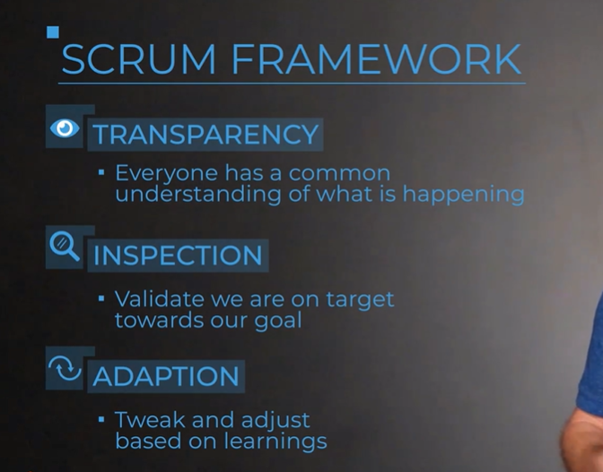
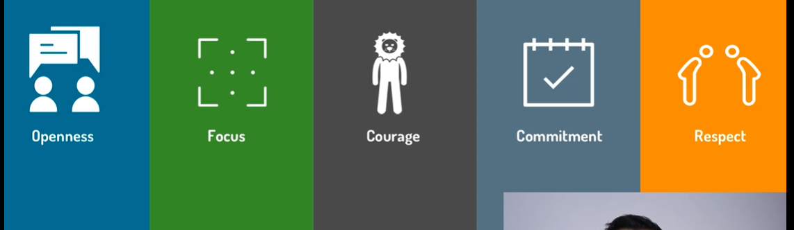
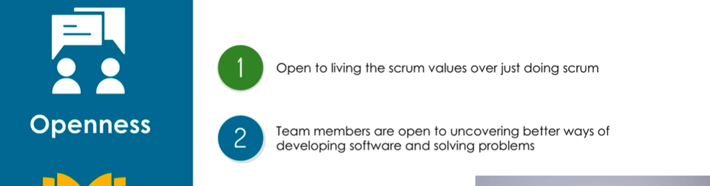

## Scrum Overview

```txt
Scrum is a framework
for delivering, developing, and sustaining complex products.
It's built on the foundations of agile,
of iterating and adapting to change,
as well it follows the philosophy of empiricism,
which is learning through experimentation
and making decisions based on what is known.

Scrum provides a blueprint or a pattern that can be followed
to deliver solutions that satisfy the customer needs.
It does this by dictating roles, events, and artifacts
as well as rules and best practices
to help tie everything together.

We're gonna get into more specifics in later lectures,
but first, we need to understand
the three pillars of Scrum:
```

## Scrum 3 Pillars

1. **Transparency**

* The process
must be visible
* The language used
must be common
and understandable
* Have a shared understanding
* Information is shared
openly and freely

2. **Inspection**

* Measure advancement towards the goal
* Identify non-desirable issues that would inhibit reaching the goal


3. **Adaption**

* Adjust processes, solutions, and decisions
* Avoid or correct issues identified during the inspection



## Scrum Values



1. **Openness**



2. **Commitment**

* General understanding of Commitment in this context is to commitment
to the sprint goal. However, it's more than that !  

* Team commits to working as a team and doing their best to bring value
to the customer  

* Team commits to give their best
action & effort Versus to the
results at the end of the Sprint.

3. **Focus**

```txt
These values are very powerful and effective
because Scrum is leveraged by a team
and these values really support team members
when they are working to solve complex problems.
```

* Focus on the sprint's worth of work

* Focus on removing solving problems
and removing impediments

* Focus on the bringing
value to customers

4. **Courage**

Mark Twain said - 
"Courage is not the absence of fear,
it is acting in spite of it."

* Team members show up with courage when working in tough problems

* Team members show up with courage while dealing with constant change
and adapting.


```txt
Courage in this context means that team members show up
with courage when they're working on tough problems
and they're not afraid to try
and come up with their bold ideas.
Change is usually hard and we are not perfect.
However, this Scrum value encourages team members
to do their best despite of not being perfect
and despite of change being hard.
```

5. **Respect**

* Respect each other in the team and be professional
* Respect and embrace the differences (different opinions, ways of working,
solving problems culture and background)

```txt
Whenever we are working on difficult problems
and we are working as a team
and we share our success and failures together,
we will be professional
and we'll respect the team members culture,
their background, their ways of working
and we will also respect their opinion.
Those are the five strong values
and if team members focus on embracing these strong values
on a day-to-day basis,
it is much effective for teams to acquire the agile mindset.
```