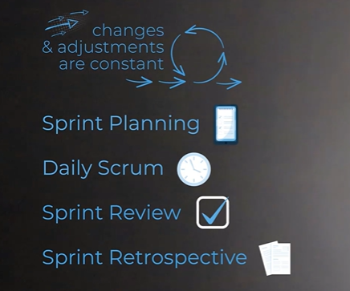
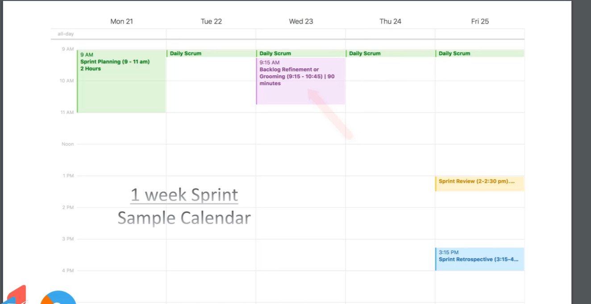
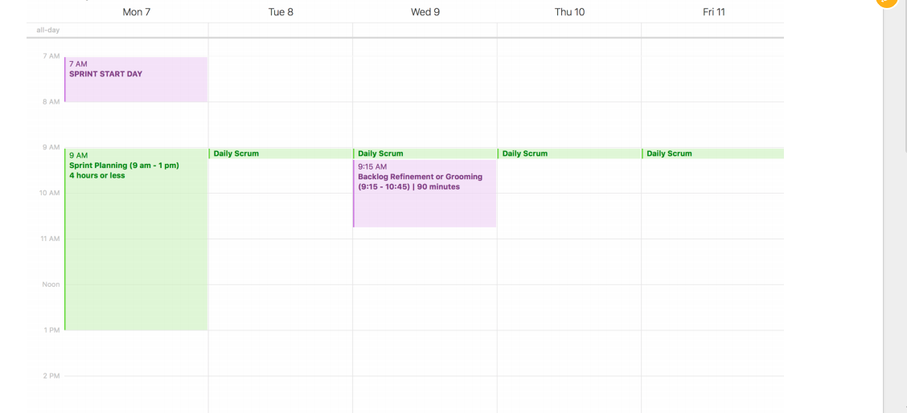
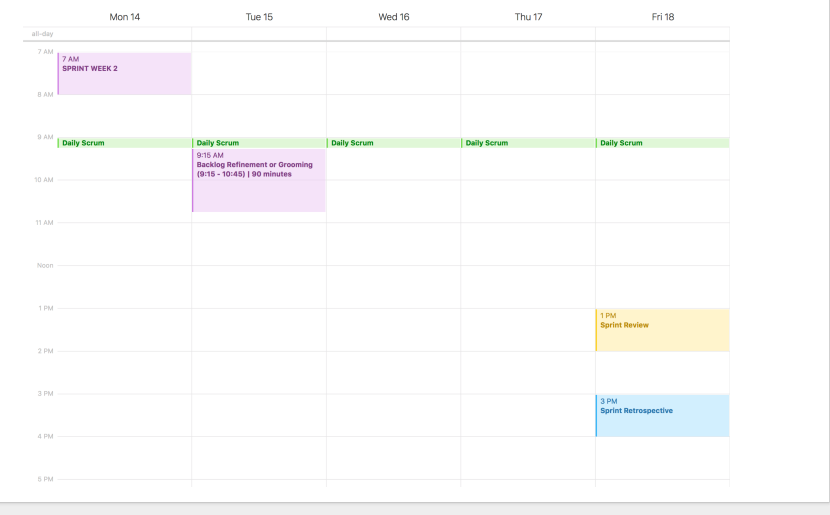

# Scrum Methodology : Scrum Cermonies and Events



* **Spring Planning**

```txt
It's a 2 to 4 week repeating cycle where the teams completing work and this sprint planning happens
once every sprint, and it's typically a few hours long.
It's where the scrum team is getting together to set the work that will be executed during that sprint.
They're making their commitments.
So during the event, the scrum team reviews all of the items in the product backlog to gain a shared
understanding on the identified needs and their priorities.
Ultimately, that order of the backlog.
Now, once that shared understanding is reached, the product owner provides direction on a sprint goal
and after some discussion and negotiation with the product owner, the development team who uses their
their past experiences and learnings as a guide, they commit to the product backlog items that they
can complete and have ready to be released or in a releasable state by the end of the sprint.
And these committed items, these things that the development team commits to becomes the sprint backlog.
So that sprint planning, we define the work to be done within that sprint.
```

* Daily Scrum

```txt
Now this is a daily meeting that's 15 minutes long and happens at the same time in the same place every single day.
Here, the development team validates progress towards the sprint goal and plans work for the next 24 hours.
Now how this is done is open to interpretation, but many development teams have adopted a technique
where each team member answers three questions.

So the first one is what did you accomplish yesterday?
Second one, what will you accomplish today?
And finally, do you see any impediments for you or other team members?

These answers then provide the team the necessary information to check the progress towards their sprint
goal, and then be able to adapt and adjust as they learn and make discoveries and run into different roadblocks.
Now, in order to keep this meeting within that 15 minute time box, each team member needs to be concise
and only provide the information the whole group needs to hear.
More detailed discussions and collaborations absolutely still can be had, but those should be scheduled
separately outside of that daily scrum time box.
```

* **Sprint Review**

```txt
As our sprint is ending, we perform the third scrum event, the Sprint Review.
Typically, the sprint review is scheduled for a couple hours and ends up usually being about half the length of your sprint planning event.
But the sprint review is where we inspect the increment that was created.
We look at that work that was done and we demonstrate the new functionality and features, process,
whatever it is to those stakeholders, to our users.
And we get crucial feedback that we can use to adapt the future product.
Ultimately, that feedback helps us to adjust and add and reprioritize items in our product backlog.
But also during this event, the product owner is providing transparency into the sprint.
They're explaining the work that was done, the work that wasn't able to be completed, and any issues
or challenges that were faced.
That helps the stakeholders understand how things are moving along.
But as well, the product owner also looks ahead and previews some of those upcoming items, those items
that are floating towards the top of the product backlog.
Ultimately, those things that are high importance to the business.
So that's the sprint review where we're inspecting that increment.
```


* **Sprint Retrospective**

```txt
And finally, that brings us to our fourth scrum event, the Sprint Retrospective.
This event happens sometime after the sprint review but before the next sprints sprint planning event.
It's the full scrum team, the Scrum Master, the product owner and the development team and they get
together and they perform a self-inspection.
This is a formal opportunity, every sprint for the team 
to inspect what they've done, 
identify and prioritize items that went well, 
as well as those things that need improvements.
And then they look to create a plan to implement changes based on their learnings.
Ultimately, they're inspecting and adapting.
Now.
Not to be confused with the sprint review.
This is not where we review the product backlog items that were completed, but more so the sprint retrospective
reviews, the process, collaborations and communications that took place within the team.
The goal of the retrospective is for the team to learn, grow and become even more effective and impactful.
So that is the sprint retrospective, where the scrum team inspects and adapts to itself.
```

## Backlog Grooming(Refinement)

Product Backlog is reprioritized and user stories are resized &
refined (as appropriate) in prepration for the next sprint

## Calendar Views

* 1 week sprint


* 2 week sprint




