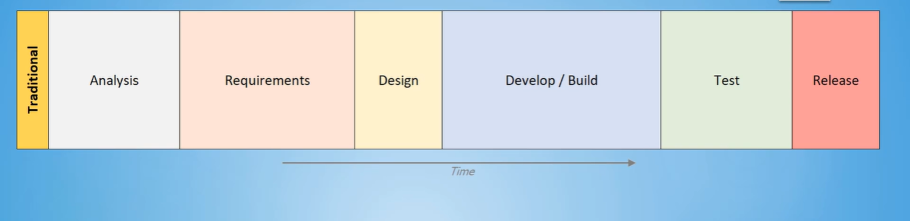
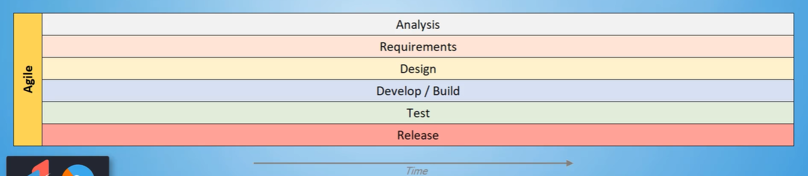
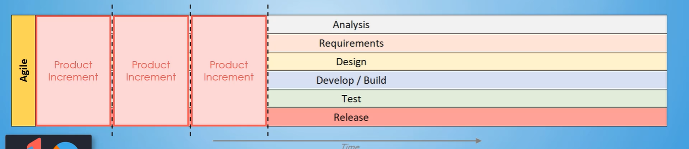

# Scrum Methodology : Scurm Terms and Artifacts

## User Stories


## User Stores : Acceptance Criteria


* **Acceptance Criteria enriches the user
story by making it testable** and ensures
the story is ready to for demo


If it is greater than 7, splint it into another user story.

## Writing Great User Stories

INVEST Acronym


```
The first one is independent.
Independent just means
that when you're writing a user story,
you don't have any dependency with any other user story
and a team can spin it and get it to done
without having to depend on any other user stories.

The second one is negotiable.
Whenever product owner or product manager is coming to the team
and he's bringing the card
based on his understanding of the needs
and the goals of the users,
this user story should be negotiable,
meaning once after talking to the team,
if the product owner has a better idea,
this user story should be flexible
so that it can change and adapt to the needs of the user.

The third one is valuable,
that this user story has some concrete value to the users.

The fourth one is estimatable.
This just means if you have a user story,
you should have some idea
on how much complexity this story has.

The fifth thing is small.
It should be small enough for team members
to finish this in a few days.

And the last thing is testable.
Whenever you're writing a user stories,
you should be able to test that user story.
And if you pay attention to these six things,
you'll be able to come up with great user.
```

## Product Backlog and Sprint Backlog

* The **Product Backlog** is a prioritized list of user stories
outlining the needs of the business
  * It is expected that the **Product Backlog** will continue to grow
in size as the wants of the business typically never ends


* The **Sprint Backlog** is created from the **Product Backlog** in the **Sprint Planning** ceremony
  * The **Sprint Backlog** contains the user stories the team is committing to complete in the upcoming sprint

## Working Agreements

* A **Working Agreement** is a list of rules, expectations, and
procedures that govern how a team will work together
  * The Working Agreement must have buy-in from each
team member
* **Agile Best Practice:** Make the **Working Agreement** visible and accessible
`
* The **Working Agreement** is a living document, meaning it
should be updated and changed as needs change

## Definition of Ready

* **Definition of Ready** is a mutually agreed upon set of conditions a user story must meet for development to begin

**Ready** means the user story contains
enough details to be worked

```txt
-: Definition of Ready is one of the most important part of the working agreement.
Setting up Definition of Ready is Scrum Master's one of the crucial responsibilities, as well.
Usually in teams, Definition of Ready
applies to the user story.
Again, what is a user story?
User story is a very simple brief statement
describing the feature
or the work that has to be done by the developer from an end user's perspective.
So how does a team member know when the user story is Ready?
Most of the times what we see
is Definition of Ready has that the user story
actually has who, what, and why.
Who is the customer?
Who is going to use it? Or the end users?
What do they want? And why do we need it?
Why is the reason why we are working on this story?
So those three things are crucial in your user story.
The other thing that's very crucial in user story is the exceptions criteria.
So what are the criterias for this user story to be done?
That needs to be there
before a developers can pick up the story and start working.
Overall, the Definition of Ready
means the user story is actionable.
The user story has what needs to be done
and the amount of work and the complexity of the work.
Obviously having the exceptions criteria.
So when you read the user story,
it should be clear, concise, and actionable.
```

## Definition of Done

* **Definition of Done** is a mutually agreed upon set of conditions
a user story must meet for it to be considered **"done done"**

* This is an agreement document that team creates so that it's accessible by everybody
and it is a common understanding that everybody has at that point of time, and it's an ever-evolving document.

```txt
What we mean by that
is when teams starts with a checklist of items,
when these items in the checklist are done,
we know this story is done.

Let's look at a unit of work.

Take a user story.

How do we know when we are done with the user story?

One of the things that I've used in my team is start with a very simple document.

For one of the teams that I used to coach,
it was as simple as this.

That user story meets the exceptions criteria
by the product owner.
So whatever product owner said,
those conditions of acceptance,
that piece of work actually includes those.

The other thing is, it's properly tested.

The other checklist in the Definition of Done document is,
there is code review or peer review
in that story or that piece of code.

And once we have all that,
we need two more things.
We need a lightweight documentation
on what was being done in that user story.

And then the last thing is
the story must be given to a product owner for review.

And if we finish all those things,
we would consider this story or piece of work as done.
```

* AGILE TIP:  
**Definition of Done** can be
it's own document, but it
generally found as part of
the Working Agreement

* AGILE TIP:  
**Definition of Done**
checklist items may vary
depending on the project
you are working on.

* AGILE TIP:  
**Definition of Done** is
extremely important in
Agile since there aren't
strict project phases,
such as in a Waterfall
approach.

* AGILE TIP:  
The **Working Agreement**,
which contains the
**Definition of Done**,
should be accessible and
visible to the team
members.

* **"Done done"** is a common Agile term meaning entirely finished and ready to go live

## Product Increment

A potentially shippable, vertical slice of a solution that is created as part of a Sprint time-box.

> Below is waterfall method



> Aglile



