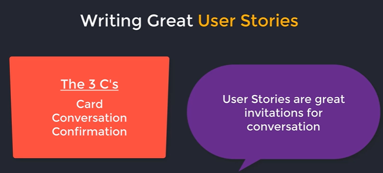
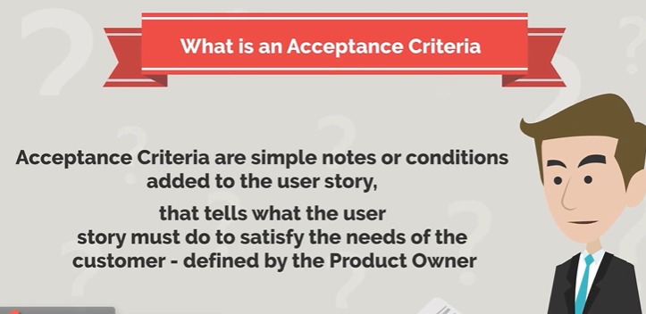
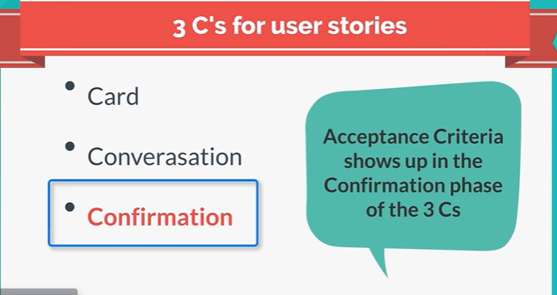
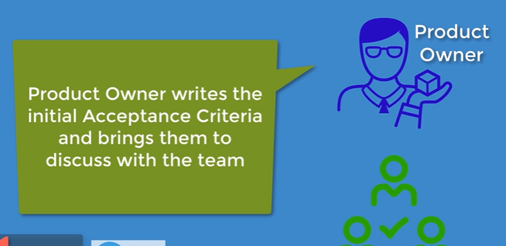
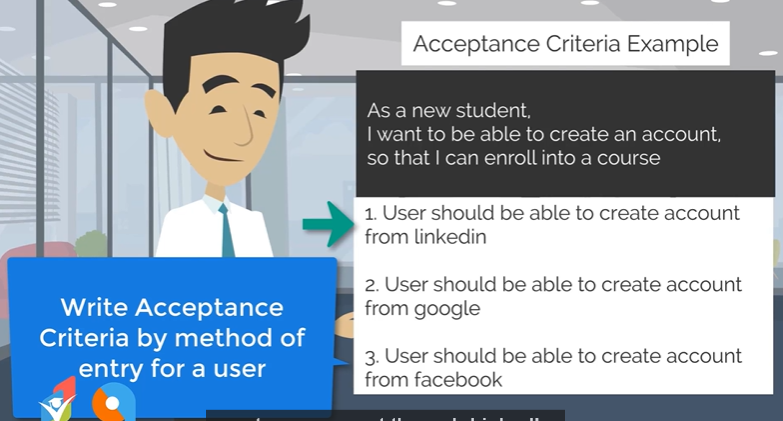
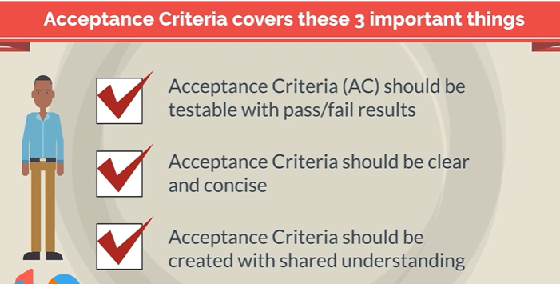
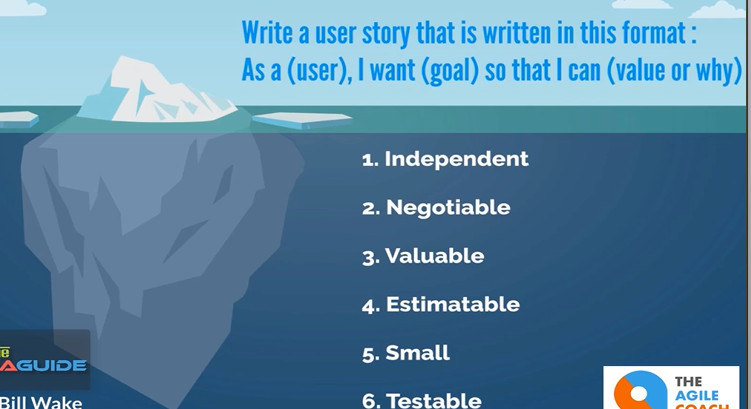

# Scrum Methodology : Scurm Terms and Artifacts

## User Stories




## User Stores : Acceptance Criteria





* **Acceptance Criteria enriches the user
story by making it testable** and ensures
the story is ready to for demo








If it is greater than 7, splint it into another user story.

## Writing Great User Stories

INVEST Acronym



```
The first one is independent.
Independent just means
that when you're writing a user story,
you don't have any dependency with any other user story
and a team can spin it and get it to done
without having to depend on any other user stories.

The second one is negotiable.
Whenever product owner or product manager is coming to the team
and he's bringing the card
based on his understanding of the needs
and the goals of the users,
this user story should be negotiable,
meaning once after talking to the team,
if the product owner has a better idea,
this user story should be flexible
so that it can change and adapt to the needs of the user.

The third one is valuable,
that this user story has some concrete value to the users.

The fourth one is estimatable.
This just means if you have a user story,
you should have some idea
on how much complexity this story has.

The fifth thing is small.
It should be small enough for team members
to finish this in a few days.

And the last thing is testable.
Whenever you're writing a user stories,
you should be able to test that user story.
And if you pay attention to these six things,
you'll be able to come up with great user.
```

