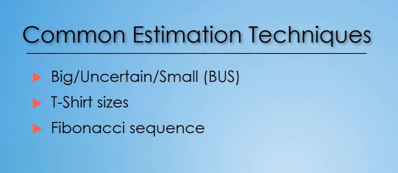

# Estimating in Agile

* Used to Estimate
  * Elicited Information
  * Past experiences
  * Documentation

## Estimating in Agile

**Non-Agile**  
* Absolute Estimate
* Measured in days
* Updates usually cause major impacts

**Agile**  
* Relative estimate
* Placed into a bucket
* updates usually cause minor impacts

```txt
Agile is a little bit different.
Agile looks at things relative to the other features,
items, tasks, that were estimated as part of that project.
So Agile looks at it and says,
"Is this a small, or is this a medium,
or is this a large item?"
We don't care about specifically how long
we feel it's going to take us.
We just need to know: is this small, medium or large?
What bucket does it go into?
And now when we say a relative estimate,
the reason we say that is,
it's relative to the other items
that have already been estimated as part of that project.

So let's break that down a little further with an example.

On the screen, you'll see a fly, a frog, and an elephant.
The fly is small, the frog is medium,
and the elephant is large.
So as we're working through,
if we were trying to categorize, or bucket,
a whole bunch of animals, we would use these
as our relative sizing.
If we find a rhinoceros, it's gonna be a large,
it's gonna go with that elephant.
If we find a butterfly, maybe that goes with the frog,
cause it's the same size of the frog,
or maybe it's really small butterfly and goes with the fly.

So you can start to do the sizing or the estimating
based on relativity to the other things
that were already estimated.
Now the thing to recognize
with the relative estimate is that relativity
is really only inside of that project.
So those team members are estimating tasks
based on other tasks or features that were
already estimated as part of that project.
And so they're gonna look to try to put it
in that small, medium, or large bucket.
But those buckets don't necessarily apply
to every other project.
```


```txt
Let's look at another one.

So here we've got a lady bug, an elephant, and a tree.

The lady bug here represents the small,
the elephant is now a medium in this particular project,
and the tree is a large.
So as you can see, even though
that elephant was a large estimated item
as part of the previous project,
that exact same item or requirement or feature
could be estimated as a medium
as part of a different project.
It's just, it's all relative to the other items,
the other tasks, the other features,
that are being estimated out.
So that's a really important concept to grasp.
So I hope that makes sense in regards
to a relative estimate from an Agile standpoint
to more to a-absolute estimate in non-Agile.
```

## Estimating in Agile : Why Estimate?

1. **Provides estimated duration**

```txt
is an estimate's providing you
an estimated duration for completion.
About how long do you think
it's going to take you to complete this feature
based on the requirements you were given?
From an agile standpoint, they'll put it into a bucket
in, the examples we gave earlier, small, medium, large,
but that could be different buckets
based on various techniques,
as you'll learn about in a future lecture.
```


2. **Drives out clarification questions**

```txt
When you're asking somebody to commit something,
you're asking them to commit an estimate
for a particular task.
They're gonna spend a little bit extra time
making sure that they read the feature,
they read all those requirements,
they read the acceptance criteria,
and they have a good understanding of how they would go
to accomplish this particular feature.
Now with doing that, they're gonna also
drive out additional clarification questions,
or unknowns that weren't defined there.
So by asking for an estimate, not only are you going
to potentially get a duration back,
you also are gonna get clarifying questions of things
that you need to dig in further to and make sure
that you have defined as part of the requirement
prior to that requirement actually being able
to be completed by that developer
or the person creating that solution.
```

3. Highlights complex and high risk tasks

```txt
As you're working in projects more and more,
you get a sense of how long things take.
When you're writing your user stories, your features,
you have an idea of this is a small,
medium, or a large type of task.
Now that's gonna be really useful when you hand that
to somebody that's going to be creating it,
and then they give you an estimate back and they say,
"Okay I think this is a medium requirement,
or a medium feature."
You may say, "Wait a minute, I was thinking it was a small,
so let's talk through a little bit."
"What are some of the complexities?"
"What are some of the risk items
that made you consider it a medium?"
So it helps to bring conversation and highlight
some of those complexities and risky issues
that you may not have been aware of or accounted for.
Now by highlighting and by knowing that information,
you can make adjustments.
Maybe you tweak the requirements a little bit, maybe you tweak that feature to make it less complex by taking very little away from it, or changing it very little.
Maybe you look to mitigate or remove those potential risks
that were identified as part of that feature,
and so then it can be reduced in size.
Ultimately, the goal isn't to reduce the size,
but it's to make sure that it's in line with expectations
and with what would wanna be done
for the value that feature provides.
```

## Estimating in Agile : Estimation Techniques(Part 1 of 2)



### 1. Big/Uncertain/Small(Bus)

* Categorized into groupings
  * Big, Uncertain, Small

* Each user story is compared to others and
assigned to a group
  * 'Big' stories should be broken up if possible
  * 'Uncertain' stories need to be groomed or broken up

### 2. T-Shirt Sizes

* Categorized into typical t-shirt sizes
  * **XS, S, M, L, XL**
  * > Because it's very global. so it's very popular

* Each user story is compared to others and
assigned a t-shirt size
  * Larger stories should be broken up if possible

```txt
The large and extra large user stories
are the ones that you should look at
and see if you can break 'em up, if possible,
into smaller user stories, ones that would fit
into that extra small, small, or medium size buckets.
It's not always gonna be possible,
but highly recommended that you don't have many
if any, large or extra large stories
as you move forward to begin some of your sprint planning.
So that's the T-shirt sizes estimation technique.
```