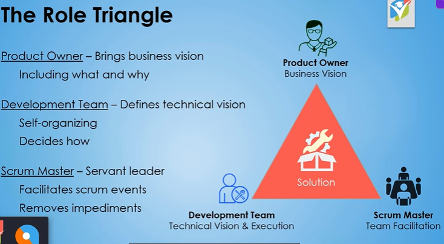
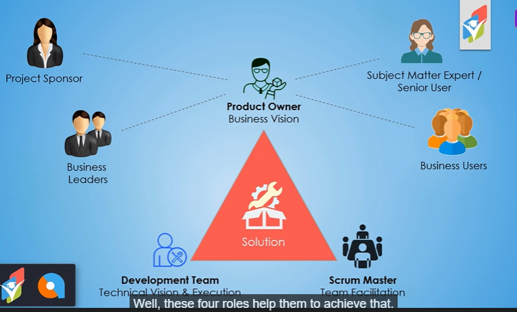
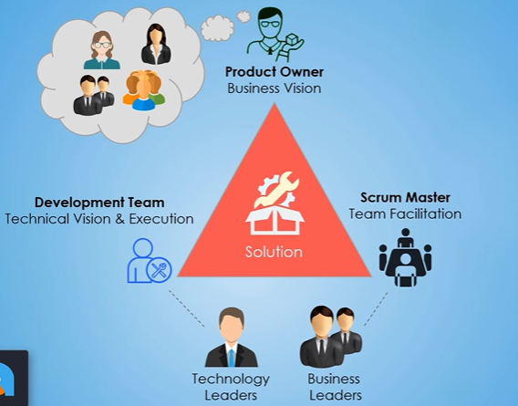
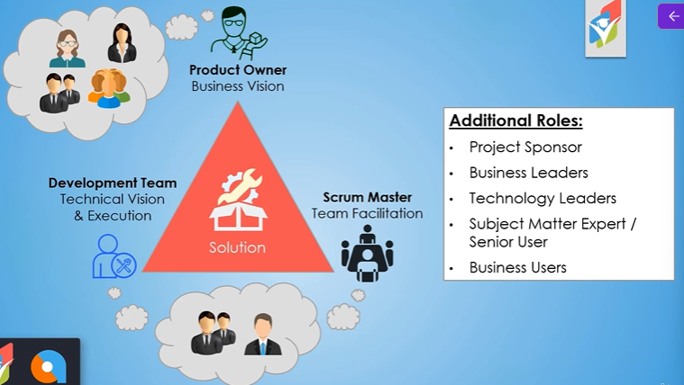
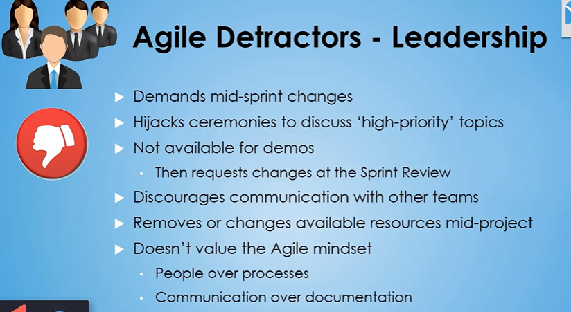
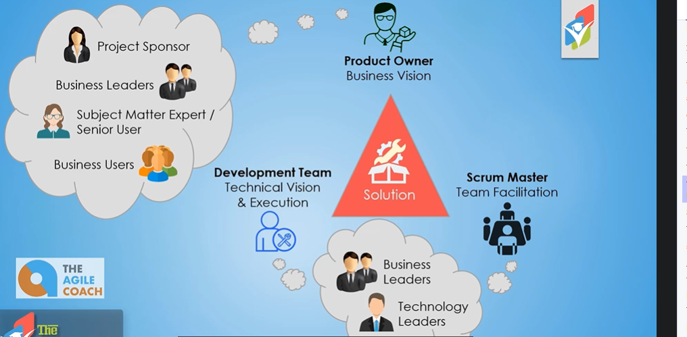

# Other Agile Roles



* Project Sponsor
* Business Leaders
* Subject Matter Expert/Senior User
* Business Users



We have another role also





## 1. Project Sponsor

Approves project and budget  
Provides the big picture view  
Helps shape the project need and outcomes  
Ensures project stays aligned to company objectives  
Participates in Sprint Reviews (and other feedback demos)  
Recognizes the team for quality work  
Encourages cross-team / cross-department collaboration  
Provides perspective on product impact and use  

## 2. Business Leaders

Enables access to necessary business resources  
Provides the needs of management  
Ensures user story results are creating value for the business  
Escalates resolution of identified impediments (as needed)  
Participates in Sprint Reviews (and other feedback demos)  
Encourages cross-team / cross-department collaboration  
Acknowledges team successes and provides support  

## 3. Technology Leaders

* **Hires team members with the right skillset**
* **Gives up control - empowers, trusts, and supports the team**
* **Enables access to necessary technology resources**
* Escalates resolution to identified impediments (as needed)
* Participates in Sprint Reviews (and other feedback demos)
* Encourages cross-team / cross-department collaboration
* Acknowledges team successes and resolves team conflicts
* **Ensures solution is aligned with organizational standards**

### Agile Detrators - Leadership



### 4. Subject Matter Expert/Senior User

* Provides their needs and the needs of other users
* Participates in Sprint Reviews (and other feedback demos)
* Provides continuous feedback on product deliverables
* Gains and communicates feedback from other users
* Provides perspective and context for requirements
* Completes requested testing in a timely manner
* Ensures user story results are used properly

```txt
These are the people on the business side
that have been working in that industry,
working in that business for a while.
They get it,
they know the technology,
and or they know the processes,
and or they know the industry and the business.
```

### 5. Business Users

* Provides their needs (differentiates wants and needs)
* Provides perspective and context for requirements
* Attends feedback demos they are invited to
* Attends, watches, or reads training on deliverables
* Utilizes deliverables and gives feedback
* Completes requested testing in a timely manner

## Agile Coach



Agile Coach  
* Experienced Agile Practitioner
* Trains, guides, and supports

```txt
And that is the Agile coach.
The Agile coach is an experienced Agile practitioner.
This could be a consultant,
it could be somebody that works within the organization.
They're there to help train, guide,
and support the full Agile for the organization.

So they're experienced in the Agile ways,
they understand the ceremonies,
they understand the terms,
they understand the roles and responsibilities.
And so they're helping everyone,
all those various roles know what their roles
and responsibilities are
within the various aspects of the project.

But beyond that, they're also ensuring
that the ceremonies that are being done are done correctly,
according to the guidelines that the Agile values
and principles are being upheld within the organization.
So a lot of times an Agile coach is brought in,
obviously as companies are transitioning to Agile.

But even after that, a lot of 'em hang on
to an Agile coach, just to really sit back,
see the full picture,
and help guide the organization forward with Agile
and make sure that everybody knows what they're doing
and point out any type of issues,
or changes that need to be made for the organization
to be better from an Agile perspective,
or just better from an overall perspective.
```

## Applying this knowleget to ther Agile frameworks

```txt
Now one point of clarification
is we've talked about and taught you about
these five other Agile roles,
the project sponsor, the business leaders,
technology leaders, senior users, and business users.
And we've taught you these
based on kind of a Scrum perspective.
```

```txt
So the roles and responsibilities that we've taught
throughout this section can be applied
regardless of the framework.
We just applied it to more of a Scrum-looking framework
because that's what's familiar to you
'cause that's what's been taught
at this point in the course.
So I hope that helps to make sense
that those five additional roles will play a part
regardless if you're Scrum or another Agile framework.
```