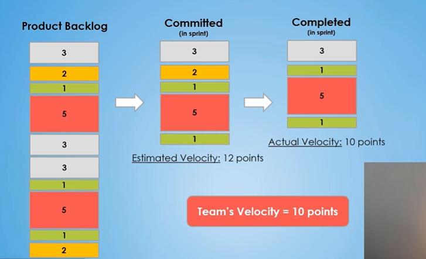
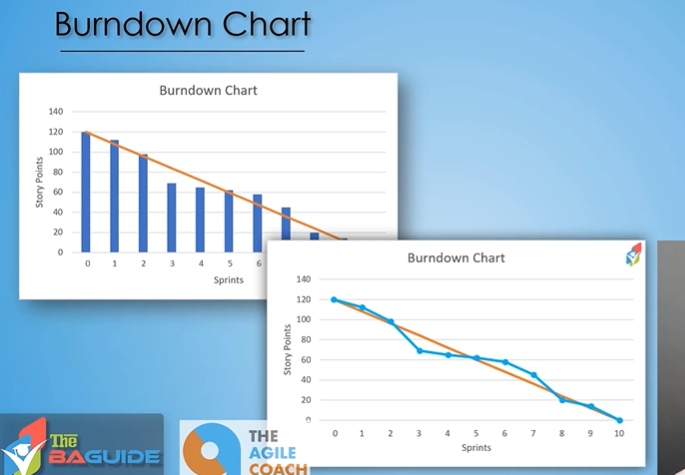
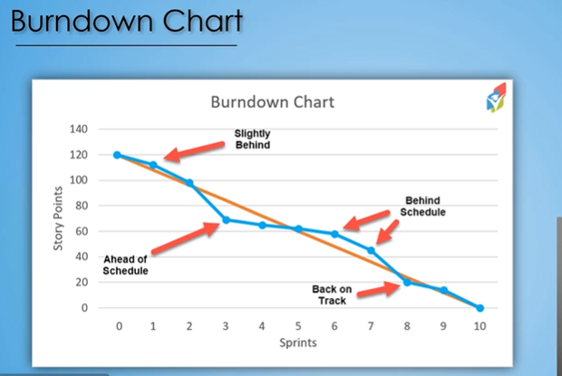
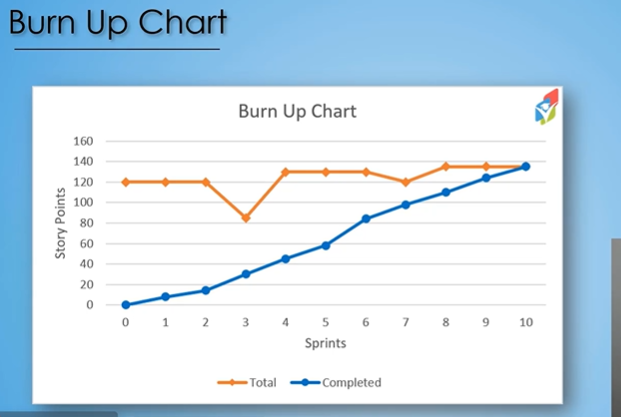
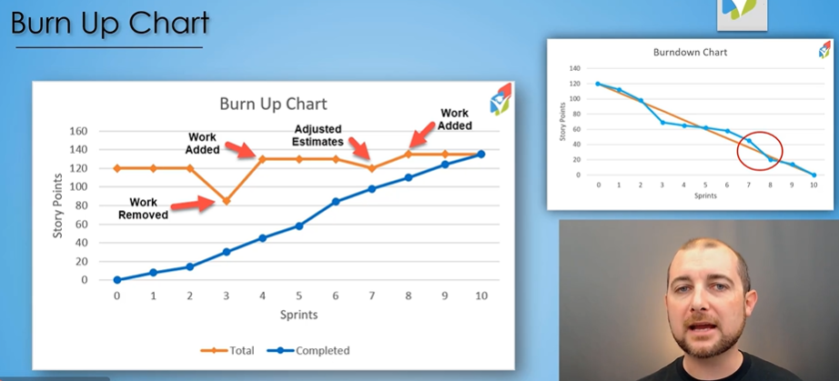

## Scrum Methodlogy : Digging Deeper

## Team Velocity

> Team velocity, in short, is how many points of stories can the team, this project team, complete in a given sprint? So, ultimately, what's the average number of story points that can be completed every sprint?



```txt
So the actual velocity of the team is 10 points.
Now, over time, over sprints,
you're able to look back and understand,
okay, how many points were we actually able to complete
in that particular sprint?
And then if you look sprint over sprint,
you're able to start to understand your team's velocity.
This is gonna help you
not only understand how long it's gonna take you
to get through the full backlog potentially,
but it's also gonna help you
as you're committing every sprint to not over commit.
If you know that you guys can complete 10 points
every single sprint,
well then, commit to 10 points
and work through them, get 'em done.
So that team velocity is going to really help
in your sprint commitment planning,
as well as the commitment of the overall project timeline.
```

## Burndown Chart



```txt
In this lecture, we're gonna teach you about a tool
utilized in Scrum called a burndown chart.
A burndown chart is a visual representation
of work being completed throughout the various
sprints of the project.
Now the design of this particular chart will be different,
depending on the tool you utilize to create it.
But ultimately, they show the same sort of data.
```



```txt
The orange line is representative
of what we want from a trending standpoint.
For us to achieve our 120 story points in our 10 sprints,
that orange line is taken into that account,
this is where we need to be in order to complete that
at the end of this project.
The blue line is the actual, this is the work
that's left remaining after that sprint is completed.
So as we look at sprint zero, we're at 120 story points.
```

```txt
So as you can tell, this burndown chart is very helpful
to a project team so they understand
where they're at in the grand scheme of things.
In a Scrum project, you're so focused
on that particular sprint, you're so narrowly focused,
working hard to get those requirements and design,
development or solution created, tested,
and ready to be delivered at the end of that sprint,
that you're not really focusing on the big picture.
So it's really easy to get lost
in where the project is overall.
The burndown chart was created to help give
a visual representation to where you're at.
That way you can make adjustments,
you know that you're behind or you're ahead.
You might be able to add some additional
nice-to-have features and stay on the same task,
or maybe you can move up your delivery date
and deliver that overall project value sooner.
```

## Burn Up Chart





|               | Burn Up                           | Burn Down                   |
| ------------- | --------------------------------- | --------------------------- |
| Tracks        | Work completed                    | Work remaining              |
| Direction     | Goes upward                       | Goes downward               |
| Completion    | Completed line reaches scope line | Remaining work reaches zero |
| Scope changes | Very visible                      | Can be confusing            |
| Main question | "How much have we achieved?"      | "How much is left?"         |

> Understanding your image

Your image contains a Burn Up chart like this:

**Orange line = Total Scope**

It represents:
> How much work currently exists in the project.

**Blue line = Completed**

It represents:
> How much work the team has completed.

So at Sprint 3:

**Work Removed**

The orange line goes down.

Meaning:
> Some work was removed from the project.

The blue line continues going upward.

Meaning:
> The team is still making progress.

At Sprint 4:

**Work Added**

The orange line jumps upward.

Meaning:
The project now contains more work.

Again, the blue line continues upward.

So the chart tells a richer story:

**The team is completing work, but the scope is changing during the project.**