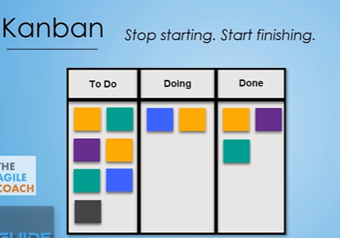
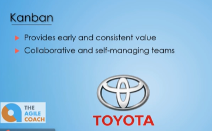
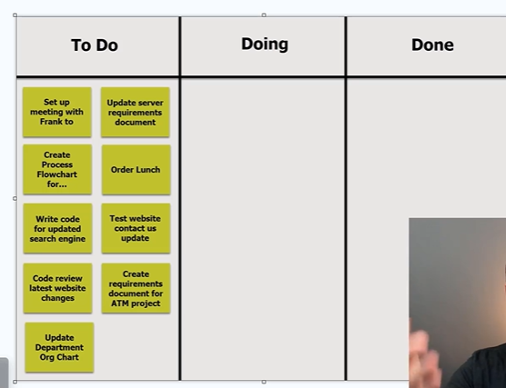
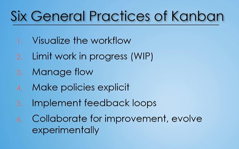
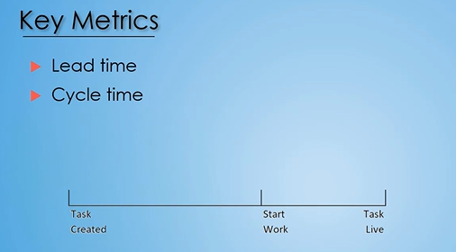
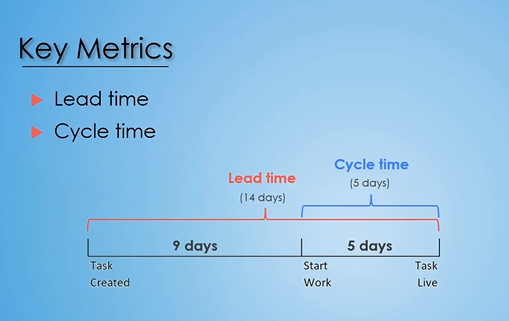

## Kanban Methodology





**Four Basic Principles of Kanban** 
1. Start with what you do now
2. Agree to pursue incremental change
3. Respect current process, roles, responsibilities, titles
4. Encourage acts of leadership at all levels

```txt
-: In this section, we're gonna teach you
about another really popular agile framework called Kanban.
Kanban is similar to Scrum
in that it provides and focuses
on providing early value to the organization
while also having collaborative and self-managing teams.
This actually all started
with Toyota back in the 1940s.
They wanted a way to more visually understand
their workflow and the work items
and to more easily identify bottlenecks in that workflow.
So they created the Kanban framework.

Now, over the years,
this has been adopted and adjusted and refined,
so it's definitely not the same Kanban
that was in the 1940s,
but it's always good to know
kind of where it started and why it got created.
Today, a lot of software companies
and different organizations
utilize Kanban to help them achieve value
in their various projects that they're working on.
```

## Kanban Board



## Kanban – Basic Notes

### What is Kanban?

Kanban is a **visual way of managing work**. A Kanban board shows:

* Work waiting to be done
* Work currently in progress
* Work completed
* Where work is getting stuck (**bottlenecks**)


### Kanban Board & Cards

A board usually has columns like:

**To Do → Doing → Done**

Each **card** represents one work item.

Example:

> Test Login → To Do → Doing → Done

The column shows the current status of the work.

### Pull System — Important

Kanban follows a **pull methodology**.

Instead of waiting for someone to assign me a task:

1. I finish my current work.
2. I look at the board.
3. I choose a suitable/high-priority task.
4. I **pull** it into **Doing**.


### Priority

Generally:

**Top = Higher priority**
**Bottom = Lower priority**

But I may skip a high-priority task if it requires skills or knowledge that I don't have.

### Flow of Work

```text
New Work
   ↓
TO DO
   ↓  ← Team member pulls work
DOING
   ↓
DONE
```

### Bottleneck

A bottleneck happens when work starts accumulating at one stage.

Example:

```text
To Do: 5 tasks
Doing: 20 tasks  ← Possible bottleneck
Done: 2 tasks
```

The Kanban board makes such problems **visible**.

## One-line summary

> **Kanban is a visual system where work is represented by cards, moves through different stages, and is pulled by team members when they are ready to work on it.**

## Kanban Cards

```txt
-: Now one thing to reiterate on the Kanban cards
is these cards aren't gonna house just the words
of what that particular work item is
and the dates and times of the status moves.
They also can house other details, such as deadlines.
They also can house different details,
like references to other materials
that can be utilized to complete that particular task.
Now, those references are a lot easier
to do in a virtual board
where you can actually attach documents
or attach links to that particular card
inside that online application,
rather than a physical board
where you're kind of writing a note
as to where to find those details
because you obviously can't have an actual link to it
when it's a physical card
taped or stuck up onto a Kanban board.
```


```txt
Because remember, Kanban conforms
to the organization it's going to.
It doesn't have that organization conform to it.
```

It means **Kanban is flexible and adapts to the organization**, rather than forcing every organization to follow one fixed process.

### Simple example

Imagine two teams:

**Team A: Software development**

Their workflow might be:

> Backlog → Development → Code Review → Testing → Done

**Team B: QA team**

Their workflow might be:

> Ready for Testing → Testing → Blocked → Retesting → Done

Kanban does **not** say:

> "No, every organization must use To Do → Doing → Done."

Instead, Kanban says:

> **"Show your actual workflow visually and manage the flow of work through it."**

So the organization can design the board according to how *its work actually happens*.

### In one sentence

> **The organization does not have to change its entire way of working to fit Kanban; Kanban can be adapted to visualize and improve the organization's existing workflow.**

That is what **"Kanban conforms to the organization, not the organization to Kanban"** means.

## Six General Practices of Kanban




```txt
Number four is make policies explicit.
What this is referring to is Kanban
is really a framework that can be structured
to your organization, it can be adjusted.
Well with that, there's not a lot of structure, or rules,
or policies that Kanban is really forcing on people.
Instead, Kanban is saying to the organization,
"You come up with those policies, you decide
when you move things from various statuses
and the various policies and procedures
that you'll have have in place
to help manage that full workflow for Kanban.
So Kanban is saying, "Make those policies explicit,
"write them down, make sure everybody's aware
"of when you move tasks, or how you manage block tasks,
"or tasks that are in progress, but are stuck."
By having those policies explicitly documented
not only will it make it easier for everybody in the team
to ensure that they're following the same type of process,
but it'll also helped continue to move
those tasks as efficient as possible.
```

```txt
Number five is all about implementing feedback loops.
So if we think back to Scrum, Scrum has sprints,
or time boxes in which you're going through
and you're completing a set of work
and then, at the end of that sprint,
you're able to look back and say, "How did we do?
"Are there changes we need to make as a team"
And anything like that.
Well, with Kanban, you really don't have set sprints.
I mean, you may have some structure set up there
for the organization if that's what the organization likes
but it's not really necessary.
This can be a fluid type of process.
Things are always added to the to-dos and they're moved
throughout the various statuses based on
where that work item is, and you just keep moving.
As you move it to done, you're releasing it out
to the users, the production environment,
getting the value from that as you start
on your next task and you're moving through.
So what I'm saying is it's a really fluid process.
There's not a good place to do those feedback loops.
So this is a general practice in here
to make sure that you don't forget about them.
Feedback loops are really important
to give feedback to the team, and to get feedback
so you can make adjustments
to make the overall process better.
Now, the main question I get asked is,
"Well when do we do this?"
"If we're not doing like a time box, a structure,
"you know, a really set structure on a sprint
"how do we handle these feedback loops?"
Well, the easiest way I've seen it done is
number one, you still have your daily standup, 15 minutes.
You're looking at Kanban board.
People are discussing what they're working on,
that work in progress and it really helps
to have the full team understand what everybody's doing
as you're looking at that visual board and talking
to people about what they accomplished yesterday,
what they're working on today and any type of roadblocks,
or problems they're running into.
And the other thing that you can do
is you can still set up like a retrospective.
And this would just be a cadenced meeting,
a meeting that happens every two weeks,
or three weeks, or month, or whatever works
for your organization and your particular project team
where you get together with the team
and you just discuss overall how are things going?
Are there issues, are there things that we can adjust
to make things easier, et cetera?
So you still wanna make sure that you're implementing
those feedback loops, even if you're utilizing
a very fluid Kanban process.
```

## Kanban Key Metrics





```txt
So, just remember, lead time -
the full time of that work item.
Cycle time - how long it takes for us
to cycle through an in-progress to get it to complete.
Now, these metrics are really important
because they can help to identify areas of issue.
So, if you're having too many items
that are work in-progress,
your cycle times are gonna be crazy.
You're gonna have really long cycle times
for a lot of different tasks.
It's gonna show that you're not really focusing
on one particular item.
You have too many items in progress.
Maybe that's because you like to start and not finish,
which is a a bad thing.
You wanna make sure you're finishing as much as you can.
Maybe it's because you keep hitting roadblocks
or you're waiting for a certain resource to be available
to help you.
And so, you have to kind of table that one
as an in-progress item
and grab another one to start working on.
Well, it's good for that to be identified
so they can get another resource to help out
or free up that resource a little bit more
so the cycle time for the overall work items
isn't quite as long.
So, these metrics are really important to track
and to take advantage of any adjustments that can be done
to improve your overall processes.
```

## Kanban Metrics Based on Board Type

```txt
-: Now with these metrics in mind,
having a digital
or a virtual board is gonna be a ton easier.
It's automatically tracking those dates
and times who moved it,
and so your cycle
and your lead times can be created pretty easily.
You can create a report and pull it out.
Or for most of the different online applications,
you can just utilize their canned reports
and pull the data out, to get your lead time
and your cycle time.
So it's pretty quick and painless.
Now with the physical board, that gets a little harder.
You have the dates and the times written
on the back of that card or the back of that sticky note,
somebody needs to physically go through,
flip 'em all over
write all those dates and times down so then they
can generate a report that's gonna provide the
lead time, and cycle time.
```

```txt
If you've never used a physical combine board it
it's so exhilarating to be able to take that sticky note
of that card and move it from doing to done.
It feels so good,
it feels like you've accomplished something
and you feel great walking up,
and moving it to complete.
So that is a great feeling
that you can't really get in the digital side.
You're going into a computer and moving the card,
it still feels good,
but not as good as a physical board.
So one adaption I've seen a team do that was
pretty ingenious actually,
is they used Trello, which is
a digital combine board,
I'm actually gonna be showing a demo
of it in the next lecture, but they use Trello
and so they have their digital board,
but, they had a smart board that was inside of their room.
So they had Trello up on the smart board.
And so people could either go on their computer
if they're not at the office, not in that room
and they could move the cards,
and everybody would see those cards moving
through the process flow,
and they would get the audits.
Or if people were in the room,
they could do it on their,
on their computer
or they could walk up to the smart board.
And the smart board, if you don't know it's
like a touch screen, so that they can go up
and they can physically move those cards
with their finger, to the next column.
So that was a way
like a really cool adaption to give the
benefits of a digital board,
while also empowering those people that are
on site with some type of physical board.
```