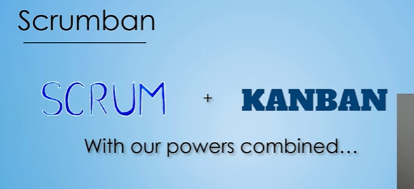
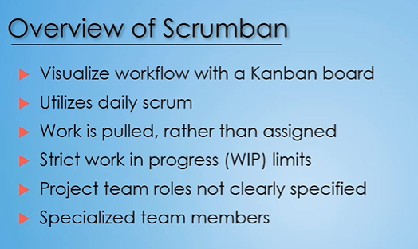
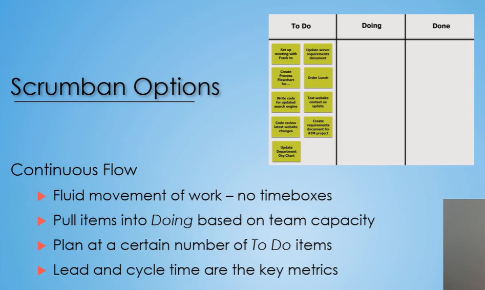
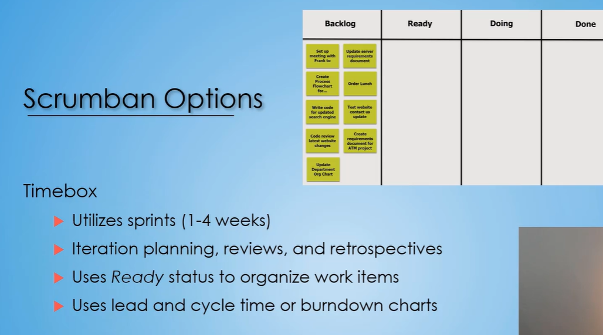

# Scrumban Methodology

## Scrumban Overview





```txt
Scrumban takes the best of both worlds from Scrum and Kanban and smashes them together into a hybrid framework
that a lot of people refer to as Scrumban.
This is a semi-structured framework that takes
some of the elements of both of the other frameworks
and puts them together.
```

```txt
In Scrum, you have the really structured team.
You have you're certain and specific roles on that team.
In Kanban, you have really no titles.
It's everybody is part of that collaborative team.
With Scrumban, it goes more towards that Kanban side.
It says we don't need specific roles.
You kind of form it with whatever roles fit your company.
So this, this framework will help to mold
to your current organization's structure.
And then it also says
that you will have more specialized team members.
If you remember back to Scrum,
we talked a little bit about cross-functional team members.
Team members that can do a multitude of things
that can help out in a lot of different areas.
Well, that's not the case for Scrumban.
Scrumban goes more of the Kanban side and says,
"We're gonna have specialized team members."
If we need to do some design,
we're gonna go snag an architect
and pull them as part of our team.
We're gonna go snag a developer and pull them as part
of our team to help us achieve our various tasks
or work items that are on the board.
```

## Scrumban Debate : Sprint

**Scrumban**  
To timebox or not to timebox, that is the question

```txt
-: Now with Scrumban, the tricky part is
you really could call any type of framework
where you take pieces of Scrum and pieces of Kanban,
you put them together, you could call them Scrumban.
The definition is saying
that you're taking pieces of both frameworks.
So there gets to be some areas of contention
or hot topics and discussions and debates in various groups.
```

## Scrumban Options : Continuous Flow



```txt
-: So let's start with the Scrumban option
of the continuous flow, which matches more towards
the Kanban side.
So for those that are looking for the continuous flow,
the big thing that they're being defined by
is that there's a fluid movement of work,
there's no timebox, there isn't a set start, a set end,
it's just work is continuing up until that project deadline
or that project due date.
```

## Scrumban Options : Timebox

```txt
-: On the flip side, let's talk about the timeboxed Scrumban.
This one's a little different because it utilizes sprints
as a way to segment out that particular project.
You're segmenting out pieces, so you have a set start
and a set end with a particular kind of section
of that project where you're able to initiate planning
and reviews and retrospectives.
So that sprint is generally between one and four weeks.
```



```txt
in the Scrumban are those that are coming from Scrum
to Scrumban to try to get away from
a little bit of that structure
and maybe burndown charts are just what
everybody is used to on the projects
and so they continue to use it.
But our recommendation is that you use lead and cycle times
for your key metric for the timebox Scrumban.
```
## Scrumban : Feature Freeze

**Triage and Feature Freeze**  
* Used as the project deadline is approaching
* Team identifies most important features not yet done
* Remainder of work items are frozen
* Focuses the team's energy on finishing critical tasks

```txt
Scrumban does use the triage and feature freeze,
especially when you're doing
the more continuous flow Scrumban.
```

## Scrumban : Target Audience

Who is the target organization?

```txt
-: The last thing I want to talk about
in regards to Scrumban is,
what is the target organization?
What organizations are utilizing Scrumban?.
There's really two type of organizations,
number one, the most common one that I see
are organizations that adopt Agile,
so they change from their,
water fall or other framework into
a structured framework such as Scrum.
They utilize that framework for
a number of years,
they get very mature in it,
very efficient with Scrum and,
the structure..
well it helped in the beginning,
you know the very structure of Scrum
it helped early on, as they were adopting
agile and getting used to it,
but now that they're a mature agile
organization, they don't want all that
structure, they want to be able to adjust it
to really conform to some of
their organizational needs.
So some of these companies will make the
decision that they want to go to Kanban,
they want to move from Scrumban to a more
unstructured frame work such as Kanban.
Well instead of making that leap,
that's a big leap, that's like
going from waterfall to scrum,
going from scrum to kanban
it's a big change as to how you do things,
so what they'll do is they'll utilize scrumban
as a stepping stone,
```

```txt
The other type of organization, it could be
like a newer organization that
want's some structure but,
maybe their industry or organization is
very specialized and it's
it's created in a way
to really help them be successful,
and they can't adopt scrum
because they can't change the roles
in everything of their whole organization
of all of their project teams
to conform to the scrum rules,
so rather then upheave everything
that they've done, and potentially risk
their organization or their
organizational revenue, they will look
to adopt scrumban which has some of that
structure from scrum, with some of those
benefits and features of the fluid
motion from kanban.
So those are the two main type of organizations
that I've seen go to scrumban, but really
any type of organization that's going to agile
could utilize scrumban,
and utilize it successfully to
move their projects forward.
```